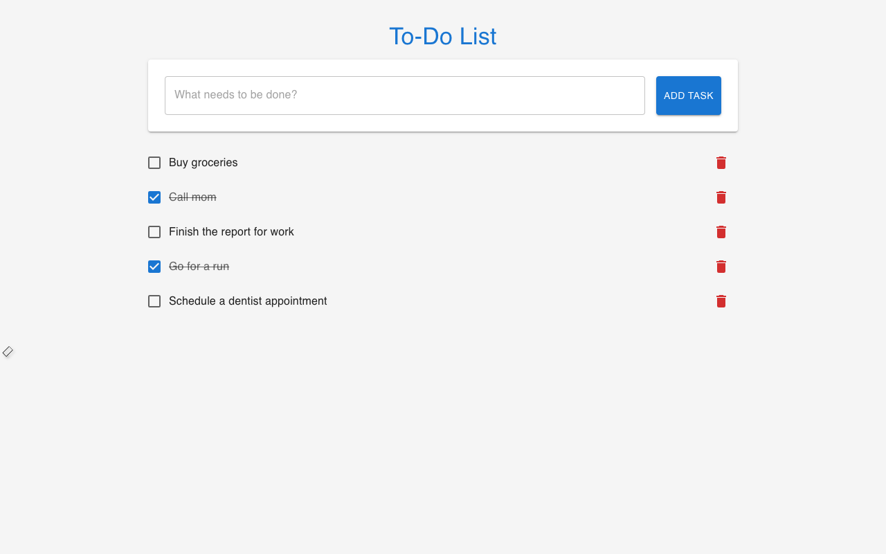

# Getting Started

Welcome! This guide will walk you through opening the Ignite Todo App for the first time.

## Opening the App

To get started, simply open the application in your web browser. There's no installation needed.

When you first launch the app, you will see:

- A clean, centered interface with the title "To-Do List".
- An input field prompting you with "What needs to be done?".
- An "Add Task" button.
- A short list of sample tasks to show you how it works.

## Your First Look

The application comes with a few sample tasks to help you get familiar with the layout:

You can interact with these tasks right away to test things out, or delete them to start fresh.

## Next Steps

You're all set! Now you can learn more about how to manage your tasks in the **[Using the App](using-the-app.md)** guide. 