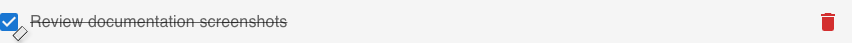
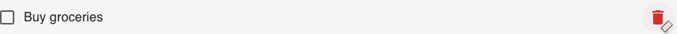

# Using the App

This guide covers everything you need to know about managing your tasks in the Ignite Todo App.

## Adding a New Task

Creating a task is simple and quick.

1.  **Type your task** into the input field at the top, which says "What needs to be done?".
2.  **Click** the "Add Task" button or press the **Enter** key on your keyboard.

Your new task will immediately appear at the top of your list.

!!! tip "Quick Tip"
    For rapid task entry, you can just type a task and hit **Enter**, then type the next one and hit **Enter** again, without ever needing to click the button.

## Managing Your Tasks

Here's how you can interact with the tasks you've created.

### Marking a Task as Complete

When you've finished a task, you can mark it as complete.

1.  **Click the checkbox** to the left of the task.
2.  The task's text will be crossed out to show it's done.

If you made a mistake, just click the checkbox again to mark it as incomplete.

### Deleting a Task

If you want to remove a task from your list permanently:

1.  **Click the trash can icon** on the right side of the task.
2.  The task will be removed from your list instantly.

!!! warning "Heads Up!"
    Deleting a task is permanent and cannot be undone, so be sure you want to remove it.

## Keeping Your List Tidy

A clean task list is an effective one. Here are a few tips for managing your list:

*   **Be Specific**: Write clear, actionable tasks (e.g., "Call the dentist to schedule appointment" instead of "dentist").
*   **Delete Completed Tasks**: Once a task is done and you no longer need a record of it, delete it to reduce clutter.
*   **Start Fresh**: If you ever want to reset the app to the original sample tasks, simply refresh your browser page. Note that this will erase any tasks you have added. 